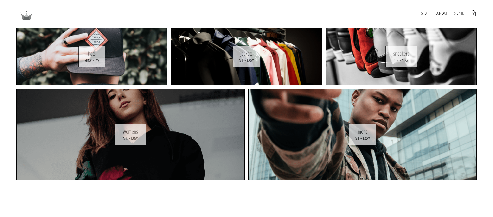
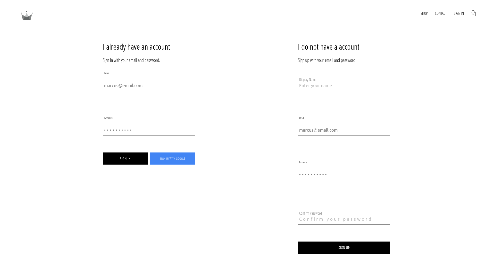
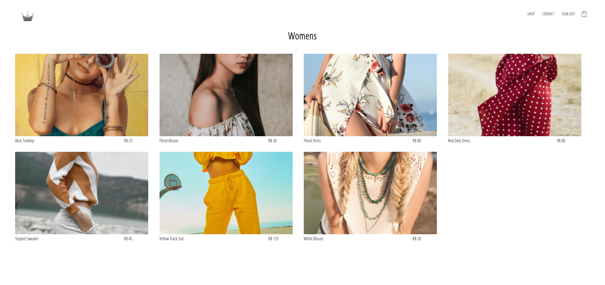
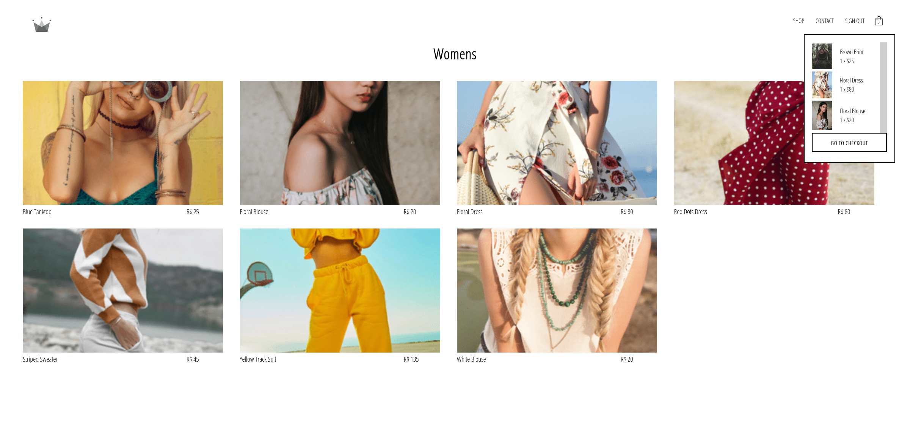
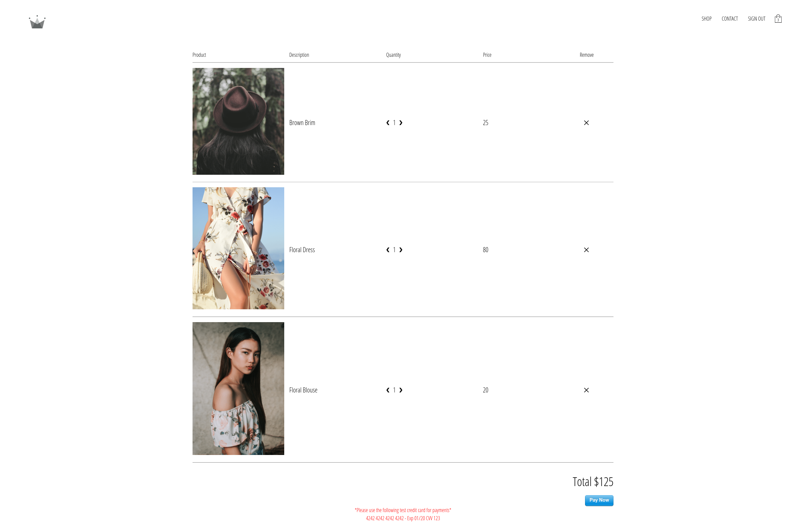

# Bem Vindo ao MovieDB React App

## Projeto loja virtual desenvolvido com React + Styled Components

https://cwrn-clothing.netlify.app/

## Tecnologias utilizadas

- React
- React Router Dom
- Context API
- Styled-components
- Redux
- Redux-saga
- Firebase
- Google Authentication

## Instruções de Instalação

1. Clone o repositorio

`https://github.com/marcusjava/cwrn-clothing`

1. Instalação

   Pré-requisitos: NodeJS instalado `https://nodejs.org/en/`

- Instalar dependencias - `yarn install`
- Criar projeto no firebase.google.com
- Ir nas configurações do projeto e setar as seguintes variaveis de ambiente REACT_APP_FIREBASE_API_KEY e REACT_APP_FIREBASE_APP_ID
- Habilitar o login do Google
- Iniciar projeto - `yarn start`
